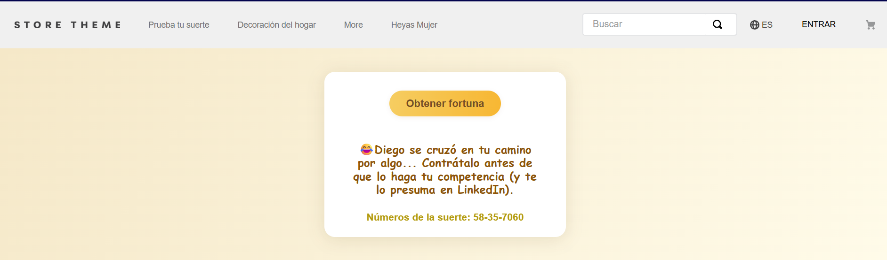

# Cookie Fortune

Una app para VTEX IO que muestra frases de la fortuna de manera aleatoria en tu tienda, y además incluye un Admin App para que los usuarios de backoffice puedan crear y eliminar frases fácilmente desde el panel de administración de VTEX.



## Características

-   **Componente Storefront**: Muestra una frase de la fortuna y un número de la suerte aleatorios, con animaciones de carga y estilos personalizables mediante CSS handles.
-   **Admin App**: Interfaz amigable en el admin de VTEX para listar, crear y eliminar frases de la fortuna almacenadas en Master Data.
-   **Configuración fácil**: Solo necesitas instalar y linkear la app en tu tienda VTEX.

💻[WS del proyecto](https://morant--valtech.myvtex.com/cookie-fortune)
🚀 [Github](https://github.com/morant901/cookieFortune)

## Instalación

### 1. Clona el repositorio

```bash
git clone https://github.com/morant901/cookieFortune.git
cd cookieFortune
```

### 2. Instala dependencias

```bash
yarn install
```

### 3. Linkea la app

```bash
vtex link
```

> Asegúrate de tener permisos de desarrollador en tu cuenta VTEX y Master Data.

## Uso

### Storefront

Agrega el bloque en tu theme, por ejemplo en `store.custom#fortune-cookie`:

```json
{
    "store.custom#fortune-cookie": {
        "children": ["fortune-cookie"]
    }
}
```

Y define la ruta en el archivo routes.json:

```json
{
    "store.custom#fortune-cookie": {
        "path": "/cookie-fortune"
    }
}
```

### Admin App

Accede al panel administrativo de VTEX:

```
/admin/app/fortune-cookie 🥹 Me faltó este
```

Desde ahí podrás:

-   **Ver** todas las frases existentes.
-   **Agregar** una nueva frase.
-   **Eliminar** frases seleccionadas.

## Personalización de estilos

Todos los elementos cuentan con [CSS Handles](https://developers.vtex.com/docs/guides/declarative-css-handles) para que puedas personalizar el estilo desde tu theme:

```css
.fortune_cookie__container {
    /* ... */
}
.fortune_cookie__button {
    /* ... */
}
.fortune_cookie__phrase {
    /* ... */
}
.fortune_cookie__lucky {
    /* ... */
}
.fortune_cookie__spinner {
    /* ... */
}
```

## Requisitos

-   VTEX IO
-   Permisos de Master Data para crear y borrar registros en la entidad `CF`

## Estructura del proyecto

```
/react-app-template/react/components
  FortuneCookie.tsx
/admin
  pages/
    fortune-cookie.tsx
/store-theme
  ...
README.md
```

## Contribuciones

¡Se aceptan PRs y sugerencias!  
Por favor abre un [issue](https://github.com/morant901/cookieFortune/issues) para reportar bugs o solicitar nuevas funcionalidades.

## Licencia

MIT
